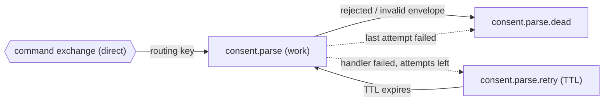
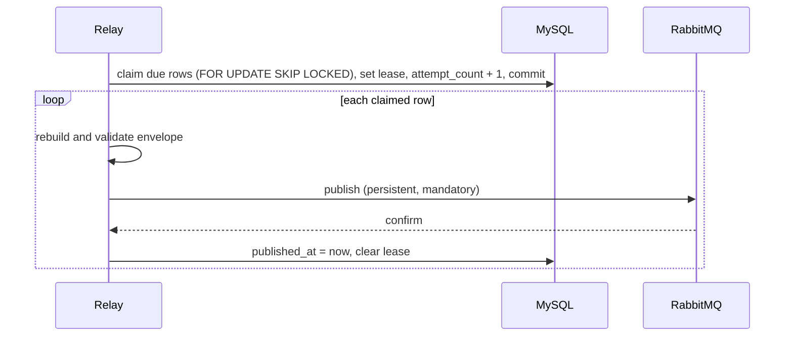

# RabbitMQ Messaging SDK

The internal messaging layer of the consent bulk import app. A domain declares the messages it sends and the queues it consumes. This layer publishes, delivers, retries, and deduplicates them.

This document is the reference the SDK is built against. Each section is marked **Built** (exists and is tested) or **Planned** (designed, not yet written). Update the marks as work lands.

## 1. Scope

**What it is**

- A thin layer over RabbitMQ for the one application in this repository. It lives in `app/Infrastructure/Messaging`.
- A transactional outbox for publishing, an inbox for deduplication, a typed message envelope, and a generic consumer with retry and dead-letter handling.

**What it is not**

- It is not the Laravel queue system. Nothing here uses Laravel jobs, `queue:work`, or the package's job classes.
- It is not a Laravel module. There is no nwidart wrapper, and the app stays one application with one business domain.
- It does not carry data. Messages hold IDs and object-storage keys, never CSV contents.

**The boundary rule**

`App\Infrastructure` never imports from `App\Domains`. The SDK knows nothing about bulk imports. A domain plugs into it by implementing `ModuleMessaging` (section 6). This keeps the SDK extractable into a package or module later, and an architecture test enforces it (section 14).

## 2. Principles

1. **At-least-once delivery, idempotent handlers.** A message can arrive more than once. Handlers must tolerate that. Neither the outbox nor the inbox provides exactly-once processing by itself.
2. **Database change and message intent are one transaction.** Anything that must be announced is written to the outbox in the same transaction as the change it announces.
3. **No network call inside a database transaction.** The relay claims rows, commits, and only then publishes.
4. **A message is confirmed before it is considered sent,** and acknowledged only after it is handled.
5. **The type of a message is its routing key.** One string identifies the message class and the binding.
6. **Domains declare, the SDK executes.** Exchanges, queues, handlers, and retry policy are declared in domain code, never hard-coded in the SDK.
7. **Failures are classified.** A broker problem and a bad message are different failures and are counted differently (section 9).

## 3. The RabbitMQ package

The app uses the installed `vladimir-yuldashev/laravel-queue-rabbitmq` package (^15.0) in one narrow way: as a connection factory.

| Used | Not used |
| --- | --- |
| `RabbitMQConnector::connect()` to open a connection from `config('queue.connections.rabbitmq')` | Laravel queue jobs and the queue worker |
| `RabbitMQQueue::getChannel()` to get an `AMQPChannel` | The package's own consume and publish methods |
| Its timeout and TLS options under `options` | Its `QUEUE_CONNECTION` default for application work |

Everything else (declaring, publishing, confirms, consuming) is the plain `php-amqplib` channel API.

**One seam (Built).** Only `Connection/RabbitMQConnection` touches the package. The publisher and the topology command depend on it, and the consume command will too. Replacing the package with raw `php-amqplib` later is a one-file change.

Connection settings come from `.env`:

| Variable | Purpose |
| --- | --- |
| `RABBITMQ_HOST`, `RABBITMQ_PORT`, `RABBITMQ_USER`, `RABBITMQ_PASSWORD`, `RABBITMQ_VHOST` | Broker address and credentials |

Exchange, queue, and routing key names are never literals in code. Each domain reads them from its own config (for bulk imports, `config('bulk-imports.messaging')`, overridable in `.env`), and declares in code only which queue receives which message (section 6).

## 4. Layout

```
app/Infrastructure/Messaging/
  README.md                         this document
  Contracts/                        interfaces a domain or the SDK implements
    ModuleMessaging.php             a domain's declaration                           Built
    MessageHandler.php              handles one delivered message                    Built
  Connection/
    RabbitMQConnection.php          the only class that touches the package          Built
  Topology/                         declarations and the registry                    Built
    ExchangeDefinition.php
    QueueDefinition.php
    MessagingRegistry.php
  Protocol/                         what travels on the wire                         Built
    MessageContract.php             a typed message
    MessageEnvelope.php
    MessageData.php
  Publishing/                       confirmed publishing, shared by outbox and consumer  Built
    ConfirmedPublisher.php
    Exceptions/TransientPublishFailure.php
  Outbox/                           publishing                                       Built
    Contracts/OutboxPublisher.php
    Models/OutboxMessage.php
    Publishers/AmqpOutboxPublisher.php
    Services/OutboxRelay.php
  Inbox/                            deduplication                                    Built
    Models/InboxMessage.php         InboxMessage::claim()
  Consuming/                        delivery handling                                Built
    DeliveryProcessor.php
    DeliveryOutcome.php

app/Console/Commands/               entry points
  RelayOutbox.php                   outbox:relay                                     Built
  RetryParkedOutbox.php             outbox:retry-parked                              Built
  DeclareRabbitMqTopology.php       rabbitmq:topology:declare                        Built
  ConsumeQueue.php                  rabbitmq:consume {queue}                         Planned

app/Domains/BulkImport/             what a domain provides
  Messaging/BulkImportMessaging.php its ModuleMessaging declaration                  Built
  Messages/                         ParseRequested (Built), ValidateChunk, AssembleImport (Planned)
  Handlers/                         one MessageHandler per consumed queue            Planned
```

Rules for adding code: group by role, create a folder only when a file needs it, and keep generic code out of `Domains`.

## 5. Concepts

| Concept | Meaning |
| --- | --- |
| **Message** | An immutable class implementing `MessageContract`. It has a static `type()` (the routing key), `data()`, and `fromData()`. It validates itself with `MessageData`. |
| **Envelope** | The wrapper around every message: id, correlation id, time, and the message. It is the only thing serialized to RabbitMQ. |
| **Exchange** | Where messages are published. One durable `direct` exchange carries all commands. |
| **Queue** | A durable quorum queue a handler consumes. Each declared queue also gets a retry and a dead queue. |
| **Binding** | Connects a routing key (a message type) on the exchange to a queue. |
| **Handler** | The domain class that handles one message type from one queue. |
| **Module messaging** | A domain's declaration of its exchanges, queues, handlers, and messages. |
| **Registry** | The SDK's collected view of every declaration. Everything else asks the registry. |
| **Outbox** | A table of messages waiting to be published, written in the same transaction as the change they announce. |
| **Inbox** | A table of messages a consumer has already handled, used to skip duplicates. |

## 6. Declaring messaging

A domain implements one class. Everything here is **Built** except the handler classes and the validate and assemble messages, which arrive with their workers. In the real class the retry and prefetch values come from `config('bulk-imports.messaging.consumers')` through a small helper.

```php
namespace App\Domains\BulkImport\Messaging;

final class BulkImportMessaging implements ModuleMessaging
{
    public function exchanges(): array
    {
        return [new ExchangeDefinition(config('bulk-imports.messaging.exchange'))];
    }

    public function queues(): array
    {
        return [
            new QueueDefinition(
                name: config('bulk-imports.messaging.queues.parse'),
                exchange: config('bulk-imports.messaging.exchange'),
                routingKeys: [ParseRequested::type()],
                maxAttempts: 3,
                retryDelaySeconds: 30,
                prefetch: 1,
                handler: ParseImportHandler::class,
            ),
            new QueueDefinition(
                name: config('bulk-imports.messaging.queues.validate'),
                exchange: config('bulk-imports.messaging.exchange'),
                routingKeys: [ValidateChunk::type()],
                maxAttempts: 3,
                retryDelaySeconds: 30,
                prefetch: 1,
                handler: ValidateChunkHandler::class,
            ),
            // consent.assemble is declared the same way
        ];
    }

    public function messages(): array
    {
        return [ParseRequested::class, ValidateChunk::class, AssembleImport::class];
    }
}
```

`QueueDefinition` fields:

| Field | Default | Meaning |
| --- | --- | --- |
| `name` | required | Work queue name. `{name}.retry` and `{name}.dead` are derived from it. |
| `exchange` | required | Exchange the queue is bound to. |
| `routingKeys` | required | Message types this queue receives. A key may wait for its message class to be written. |
| `maxAttempts` | config, 3 | Deliveries before a message goes to the dead queue. |
| `retryDelaySeconds` | config, 30 | How long a failed message waits before the next attempt. |
| `prefetch` | config, 1 | Unacknowledged messages one consumer may hold. |
| `handler` | null | Class implementing `MessageHandler`. A queue without a handler is declared and receives messages, but cannot be consumed yet. |

Modules are registered in `AppServiceProvider`, which builds the `MessagingRegistry` singleton. The registry validates the declarations when it is built and throws `LogicException` when:

- a queue is declared twice;
- a routing key is bound to more than one queue;
- a queue uses an undeclared exchange;
- a registered message type is not bound to any queue;
- a handler does not implement `MessageHandler`;
- max attempts, retry delay, or prefetch is below 1.

`MessagingRegistry::queue($name)` returns one queue's definition, for the consume command.

## 7. Wire format

### Envelope (Built)

The JSON body of every message:

```json
{
  "message_id": "23d5ed78-938b-4e90-a8d1-3bd3a978dc9d",
  "type": "consent.parse.requested",
  "correlation_id": "7c1e0a52-...",
  "occurred_at": "2026-10-06T10:17:38+00:00",
  "data": {
    "bulk_import_id": "7c1e0a52-...",
    "source_object_key": "consent/import-7c1e0a52-.../source/source.csv"
  }
}
```

| Field | Rule |
| --- | --- |
| `message_id` | UUID, also the outbox row id. The key for inbox deduplication. |
| `type` | The routing key and the message class identifier. |
| `correlation_id` | The import id. Every message of one import shares it, so logs can be joined. |
| `occurred_at` | ISO 8601, set when the envelope is made. |
| `data` | The message's own fields. IDs and object keys only. |

There is no version field. If a message shape must change incompatibly, add a new type.

### AMQP properties (Built)

| Property | Value |
| --- | --- |
| `message_id` | envelope `message_id` |
| `correlation_id` | envelope `correlation_id` |
| `type` | envelope `type` |
| `content_type` | `application/json` |
| `delivery_mode` | 2 (persistent) |
| routing key | envelope `type` |

### Retry headers (Built)

The body never changes between deliveries. Attempt data travels as AMQP headers on retried copies.

| Header | Meaning |
| --- | --- |
| `x-attempt` | Delivery number, 1 on the first delivery |
| `x-last-error` | The error of the previous attempt, truncated |

## 8. Topology

For every `QueueDefinition`, the declare command creates three durable quorum queues.



| Queue | Settings |
| --- | --- |
| `{name}` | quorum, durable. Dead-letters rejected messages to `{name}.dead` through the default exchange. |
| `{name}.retry` | quorum, no consumers. Message TTL is `retryDelaySeconds`. Dead-letters back to `{name}` when the TTL expires. Uses `x-dead-letter-strategy: at-least-once` with `x-overflow: reject-publish`, so a retry cannot be lost if the broker restarts mid-move. |
| `{name}.dead` | quorum. Kept for inspection and manual recovery. |

Retries and dead letters travel through the default exchange straight to these queues, so other queues bound to the same routing key never see them twice.

**Current state (Built).** `rabbitmq:topology:declare` declares the exchange and, for each of the three queues, the work, retry, and dead queues (9 queues). Only work queues are bound to the exchange.

**Queue arguments cannot change in place.** RabbitMQ rejects a redeclare whose arguments differ from the existing queue (precondition failed). When arguments change, delete the queue and declare it again, after moving out any messages you need.

## 9. Publishing

### Writing a message (Built)

Inside the transaction that changes state:

```php
DB::transaction(function () use ($import) {
    // ... change the import ...
    OutboxMessage::enqueue(MessageEnvelope::make(
        message: new ParseRequested(bulkImportId: $import->id, sourceObjectKey: $key),
        correlationId: $import->id,
    ));
});
```

`enqueue()` stores the envelope in `payload`, the type in `routing_key`, and the envelope id as the row id.

### Outbox table (Built)

| Column | Meaning |
| --- | --- |
| `id` | Envelope `message_id` |
| `routing_key` | Envelope `type` |
| `payload` | The whole envelope as JSON |
| `available_at` | Row is claimable from this time. Moved forward on failure. |
| `attempt_count` | Raised when the row is claimed |
| `locked_until` | Lease end. A row with an active lease is skipped. |
| `published_at` | Set once the broker confirmed. Published rows are never claimed again. |
| `last_error` | The last failure message |

### The relay (Built)

`outbox:relay` is a long-running loop, run as the `relay` Compose service.



A row is claimable when it is unpublished, `available_at` has passed, it has no active lease, and `attempt_count` is below `OUTBOX_MAX_ATTEMPTS`.

**The lease** is `batch size x publish timeout + buffer`, so a claimed row stays locked long enough to publish the whole batch. With the defaults that is 10 x 5 + 10 = 60 seconds. If a relay stops mid-batch, its rows become claimable again when the lease ends.

### Failure classification (Built)

| Failure | Class | What the relay does |
| --- | --- | --- |
| Broker unreachable, timeout, channel or connection error, nack | Temporary (`TransientPublishFailure`) | Stops the batch. Every claimed row goes back with its attempt undone, becomes claimable after `OUTBOX_BROKER_RETRY_SECONDS`, and the first row records the error. Never uses up attempts. |
| Payload is not a valid envelope, type is unknown, or routing key differs from the type | Message-level | Records `last_error`, backs off `min(300, 2^attempt_count)` seconds. Continues with the rest of the batch. |
| Message returned as unroutable (no binding) | Message-level | Same as above. |
| Attempts reach `OUTBOX_MAX_ATTEMPTS` | Parked | Skipped by the relay. `last_error` is kept. |

Run `outbox:retry-parked` (optionally with a message id) to give parked rows a fresh set of attempts.

Message-level failures do not stop the batch, so one bad row cannot block the others.

### Publisher rules (Built)

- Validate before connecting: rebuild the envelope from the stored payload and check that its type equals the row's routing key.
- Hand the message to `ConfirmedPublisher`, which owns the confirm-mode channel. Retry and dead-letter copies go through the same class.
- Publish in confirm mode, one message at a time, waiting for the broker's ack.
- Publish with `mandatory = true` so an unroutable message is returned instead of dropped.
- Throw from the nack and return handlers. A nack is temporary, a return is message-level.
- After any broker-level error, close the connection so the next publish starts clean.

## 10. Consuming

### The consume command (Planned)

`rabbitmq:consume {queue}` is a long-running worker for one queue. Everything about the queue comes from its `QueueDefinition`.

- Opens a channel through `RabbitMQConnection`, applies `basic_qos(0, prefetch)`, and calls `basic_consume`.
- Waits in a loop with a short timeout so it can check stop conditions.
- Stops after the message in progress on SIGTERM, SIGINT, or SIGQUIT, and optionally on `--max-messages`, `--max-time`, or a memory limit, so a process manager can restart it fresh.
- When heartbeat is enabled, registers `PCNTLHeartbeatSender` so heartbeats keep flowing while a handler is busy.

### Settling a delivery (Built)

`DeliveryProcessor` handles one delivery and always settles it with the broker.

| Situation | Action |
| --- | --- |
| Body is not a valid envelope | Reject without requeue. The broker dead-letters it to `{name}.dead`. |
| Handler succeeds | Acknowledge. |
| Handler throws, attempts left | Publish a copy to `{name}.retry` with `x-attempt + 1`, wait for the broker's confirm, then acknowledge the original. |
| Handler throws on the last attempt | Publish a copy to `{name}.dead` with the error, call the handler's `failed()` hook, then acknowledge. |

The copy is confirmed before the acknowledge. A crash in between causes a duplicate, which handlers tolerate, and never a lost message. If the broker cannot take the copy, the exception propagates and the unacknowledged delivery is redelivered.

### Handler contract

```php
interface MessageHandler
{
    public function handle(MessageEnvelope $envelope): void;

    /** Called once when the last attempt fails, to put the domain state into a failed state. */
    public function failed(MessageEnvelope $envelope, Throwable $exception): void;
}
```

Handler rules:

1. Read the message through its typed class, never through array keys.
2. Make every state change conditional: `UPDATE ... WHERE status = 'expected'`. A duplicate then changes nothing.
3. Use deterministic object keys, so a retry finds or replaces the same artifact.
4. Do not hold a database transaction open across file or network work.
5. Throw for failures that a retry can fix. Record permanent failures in the domain state and return.
6. Write follow-up messages to the outbox inside the transaction that commits the result.

### Inbox deduplication (Built)

The inbox table has a unique key on `(consumer_name, message_id)`. A handler claims a message with `InboxMessage::claim(static::class, $envelope->messageId)`, which inserts that pair and returns `false` when it already exists. Then the message was already handled and the handler skips its work.

- The claim is made in the same transaction that commits the handler's result, so a failed handler leaves no claim and a retry is not mistaken for a duplicate. A retried copy keeps the same `message_id`.
- The inbox complements conditional updates. It does not replace them, because the claim is only committed with the result.

## 11. Failure handling at a glance

| Event | Outcome | Why it is safe |
| --- | --- | --- |
| Request fails after the file is stored | Nothing is saved, the stored file is deleted | Import and outbox row share one transaction |
| Relay stops after the confirm, before marking | Row is published again after the lease ends | Consumers deduplicate on `message_id` |
| Relay stops while claiming | Transaction rolls back, nothing is leased | Rows stay due |
| Two relays run | Each takes different rows | `SKIP LOCKED` |
| RabbitMQ down or slow | Batch stops, rows retry in 5 seconds, attempts untouched | Downtime cannot park messages |
| Unroutable message | Counted failure with backoff, rest of the batch continues | Mandatory publishing makes it visible |
| Bad envelope in the outbox | Fails before any connection is opened | Bad data never reaches a queue |
| Row used all attempts | Parked, kept with its error | Recover with `outbox:retry-parked` |
| Handler throws | Retry queue, then dead queue after the last attempt | State is set to failed through `failed()` |
| Consumer crashes mid-message | The unacknowledged message is redelivered | Handlers are idempotent |
| Invalid envelope delivered | Rejected to the dead queue | Poison messages cannot loop |

## 12. Configuration reference

| Setting | Default | Purpose |
| --- | --- | --- |
| `OUTBOX_BATCH_SIZE` | 10 | Rows claimed per pass |
| `OUTBOX_PUBLISH_TIMEOUT_SECONDS` | 5 | Longest wait for one broker confirm |
| `OUTBOX_LEASE_BUFFER_SECONDS` | 10 | Added to `batch x timeout` to get the lease |
| `OUTBOX_BROKER_RETRY_SECONDS` | 5 | Wait before retrying after the broker was unavailable |
| `OUTBOX_MAX_ATTEMPTS` | 10 | Message-level failures before a row is parked |
| `BULK_IMPORT_EXCHANGE` | `consent.commands` | Command exchange of the bulk import pipeline |
| `BULK_IMPORT_PARSE_QUEUE`, `BULK_IMPORT_VALIDATE_QUEUE`, `BULK_IMPORT_ASSEMBLE_QUEUE` | `consent.parse`, `consent.validate`, `consent.assemble` | Work queue names |
| `BULK_IMPORT_PARSE_ROUTING_KEY`, `BULK_IMPORT_VALIDATE_ROUTING_KEY`, `BULK_IMPORT_ASSEMBLE_ROUTING_KEY` | `consent.parse.requested`, `consent.chunk.validate`, `consent.import.assemble` | Routing keys, which are also the message types |

**Changing names.** A routing key is also its message's type, so change one only while no outbox rows of that type are waiting, or they can no longer be read. A renamed queue is created on the next declare, and the old queue stays on the broker until deleted.

Connection timeout is fixed at 3 seconds. Read and write timeouts are the publish timeout plus 2 seconds. Both are applied only to the publisher connection, so consumers keep the package defaults.

| Consumer setting | Default | Purpose |
| --- | --- | --- |
| `BULK_IMPORT_CONSUMER_MAX_ATTEMPTS` | 3 | Deliveries before a message moves to the dead queue |
| `BULK_IMPORT_CONSUMER_RETRY_DELAY_SECONDS` | 30 | Wait in the retry queue before the next attempt |
| `BULK_IMPORT_CONSUMER_PREFETCH` | 1 | Unacknowledged messages one consumer may hold |

Changing the retry delay changes the retry queue's arguments, so the retry queues must be deleted and declared again.

Planned settings: `RABBITMQ_HEARTBEAT` and consumer stop limits (phase 5).

## 13. Commands

| Command | Status | Purpose |
| --- | --- | --- |
| `outbox:relay {--once} {--sleep=1}` | Built | Publish pending outbox rows. Long-running. |
| `outbox:retry-parked {id?}` | Built | Give parked rows a fresh set of attempts. |
| `rabbitmq:topology:declare` | Built | Declare the registry's exchanges, queues, and bindings. Will derive retry and dead queues. |
| `rabbitmq:consume {queue}` | Planned | Run the handler of one queue. Long-running. |

Long-running processes run as Compose services (`relay` today, one per worker later). They load code at start, so restart them after changing their code: `vendor/bin/sail restart relay`.

## 14. Testing

| Layer | How |
| --- | --- |
| Messages and envelope | Feature tests (they read config): construction, validation, round trips, rejected input |
| Outbox relay | Feature tests with a fake `OutboxPublisher`: claiming, leases, batch size, backoff, parking, temporary versus message-level failures |
| Publisher | Feature tests for everything that fails before a connection opens, plus an unreachable broker mapped to a temporary failure |
| Topology | Registry tests: the bulk import declaration builds, messages resolve, queues are looked up, consumer settings come from config, retry and dead queue settings are derived, and each contradicting declaration throws |
| Delivery processing | Feature tests with a recording handler, a mocked channel, and a mocked `ConfirmedPublisher`: handled, retried, dead-lettered (including a failing hook), rejected, and no ack when the copy cannot be published |
| Inbox | First claim succeeds, a repeat is refused, a rolled-back claim leaves nothing |
| Handlers (planned) | Feature tests per handler with faked storage: the success path, a duplicate delivery changing nothing, a failure leaving a retryable state |
| Boundary | A Pest architecture test: `App\Infrastructure` must not use `App\Domains` |
| Real broker | A manual check, not CI: publish a probe, read it back, then clean up (see below) |

**Real-broker check.** Declare the topology, enqueue a probe envelope, let the relay publish it, and confirm with `rabbitmqctl list_queues -p sail name messages`. Read the message back to check the body and properties, then purge the queue and delete the probe row. To check the unroutable path, publish to a temporary exchange that has no bindings. To check retries, run `DeliveryProcessor` on a probe with a handler that always throws: the copy lands in `{queue}.retry`, and after the retry delay it returns to the work queue with `x-attempt` 2 and the error in `x-last-error`. A non-envelope body is rejected and arrives in `{queue}.dead`.

## 15. Adding a message end to end

1. Create the class in the domain's `Messages/` implementing `MessageContract`. Give it a type, `data()`, `fromData()`, and validation through `MessageData`.
2. Add it to the domain's `ModuleMessaging::messages()`.
3. Bind its type to a queue in `ModuleMessaging::queues()`, with a handler.
4. Write the handler following the rules in section 10.
5. Redeclare the topology (`rabbitmq:topology:declare`). If an existing queue's arguments changed, delete the queue first.
6. Produce the message with `OutboxMessage::enqueue(...)` inside the transaction that justifies it.
7. Add a unit test for the message, a feature test for the handler, and run the topology test.
8. Add a Compose service for the consumer if it is a new queue, and restart long-running processes.

## 16. Migration plan

| Phase | Work | Status |
| --- | --- | --- |
| 0 | Outbox, relay, envelope, typed messages, config-declared topology | Built |
| 1 | `RabbitMQConnection`, definitions, `ModuleMessaging`, `MessagingRegistry` | Built |
| 2 | Declare today's topology in `BulkImportMessaging`, switch the declare command and publisher to the registry, remove `config/rabbitmq-topology.php`, compare the broker's topology before and after | Built |
| 3 | Move messages to `Domains/BulkImport/Messages`, resolve types through the registry instead of the envelope's `match` | Built |
| 4 | Retry and dead queues from `QueueDefinition`, queue recreation, `ConfirmedPublisher`, `DeliveryProcessor`, inbox | Built |
| 5 | `rabbitmq:consume`, handlers, Compose services | Planned |
| 6 | Optional: consumer autoscaling, extraction into a package | Not scheduled |

Phase 4 was checked on the real broker: 9 queues with the expected arguments, a retried probe returning after the delay with its attempt headers, and a rejected message dead-lettered. Phases 1 to 3 changed structure only. The broker's exchange, queues, and bindings were compared with `rabbitmqctl` before and after and were identical, and all tests stayed green. The boundary architecture test was added with phase 3.

## 17. Decisions

| Decision | Choice | Reason |
| --- | --- | --- |
| Where the SDK lives | `app/Infrastructure/Messaging`, not a nwidart module | One application, one domain. New base folders need approval. |
| RabbitMQ client | The installed package, behind one `RabbitMQConnection` class | No dependency change, and swapping is a one-file change |
| Exchange type | `direct` | One routing key per message type, no wildcard routing needed |
| Message versioning | None | Demo scope. Add a new type for an incompatible change. |
| Message type | Equal to the routing key | One identifier for class and binding |
| Message classes | In the domain, resolved through the registry | Keeps the SDK independent of the domain |
| Exchange, queue, and routing key names | Domain config with `.env` overrides, never literals in code | Names can change per environment without code changes. Code declares only the relationships. |
| Module registration | `AppServiceProvider` builds the registry | One place, no extra config |
| Consumer retry settings | Domain config with `.env` overrides, passed into each `QueueDefinition` | The SDK reads no domain config for topology |
| Inbox consumer name | The handler's class name | Stable and unique per consumer, no extra config |
| Inbox claim placement | Inside the transaction that commits the handler's result | A failed handler leaves no claim, so a retry is not mistaken for a duplicate |
| Consumer heartbeat | As in engy-code: `RABBITMQ_HEARTBEAT` (60 s default), kept alive with `PCNTLHeartbeatSender` | Planned with phase 5 |
| Outbox ordering | Oldest first, but not strictly ordered across failures | Handlers must not depend on arrival order |
| CSV rows | Never stored in the database | Memory and privacy. Rows live in object storage. |
| Autoscaling | Not built. Use Compose replicas. | Not needed yet |

## 18. Open questions

- How a parked or dead-lettered message shows up on its import in the dashboard.
- Whether the retry and dead queues need a recovery command (replay from `.dead`).
- Whether message ordering matters for any queue, such as chunk completion.

## 19. References

- The `batch-processing-lab` and `engy-code` demos in the same projects folder. Their messaging code shaped the retry and dead-letter design, the generic consume command, and the heartbeat approach. This SDK keeps its own outbox, typed envelope, inbox, and boundary rules.
- The package: `vladimir-yuldashev/laravel-queue-rabbitmq`, used only for connections.
- `config/bulk-imports.php` for outbox and import limits, and `app/Domains/BulkImport/Messaging/BulkImportMessaging.php` for the topology.
